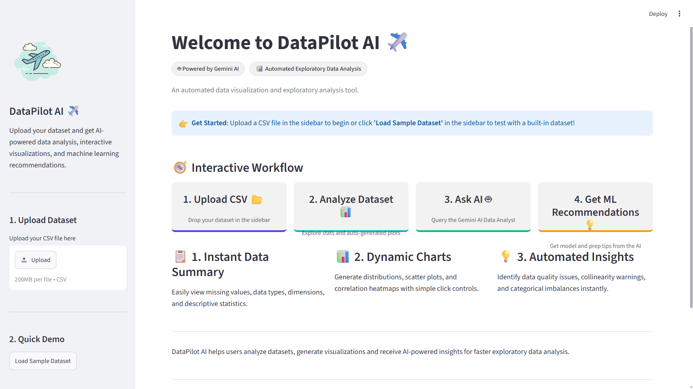
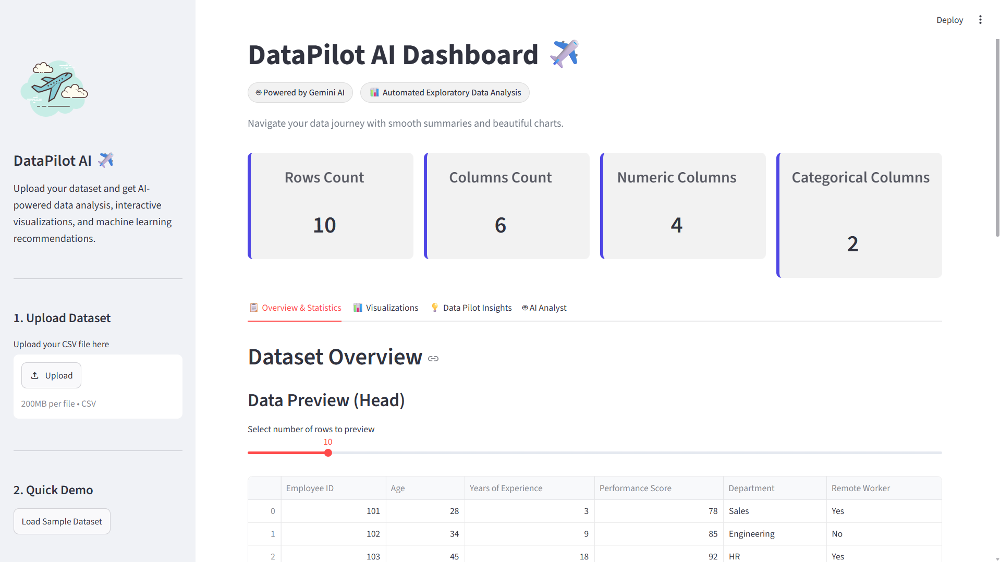
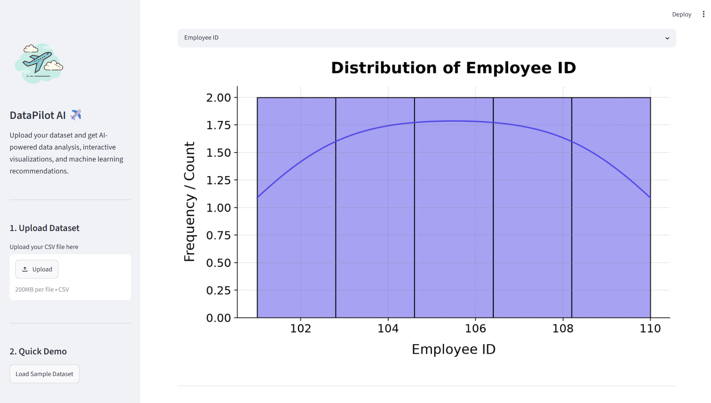

# 🚀 DataPilot AI

An AI-powered Exploratory Data Analysis (EDA) assistant that combines automated data analysis with Google Gemini AI to help users understand datasets quickly and make better machine learning decisions.

---

## 📌 Overview

DataPilot AI is a Streamlit-based web application that allows users to upload CSV datasets and instantly generate:

- 📊 Automated dataset summaries
- 📈 Interactive visualizations
- 🤖 AI-powered insights using Google Gemini
- 🧹 Data cleaning recommendations
- 🎯 Machine Learning model suggestions

The goal of this project is to simplify Exploratory Data Analysis for students, researchers, and professionals.

---

## ✨ Features

- Upload CSV datasets
- Load built-in sample dataset
- Dataset overview and statistics
- Missing value detection
- Data type analysis
- Distribution plots
- Scatter plots
- Correlation heatmaps
- Automated data quality insights
- AI Analyst powered by Google Gemini
  - Find data problems
  - Suggest ML models
  - Recommend data cleaning
  - Summarize dataset

---

## 🛠️ Tech Stack

- Python
- Streamlit
- Pandas
- Matplotlib
- Seaborn
- Google Gemini API

---

## 📂 Project Structure

```
DataPilot_AI/
│
├── app.py
├── eda.py
├── requirements.txt
├── README.md
└── screenshots/
```

---

## 🚀 Installation

Clone the repository

```bash
git clone YOUR_GITHUB_REPOSITORY_LINK
```

Move into the project directory

```bash
cd DataPilot_AI
```

Install dependencies

```bash
pip install -r requirements.txt
```

Run the application

```bash
python -m streamlit run app.py
```

---

## 📸 Screenshots

### Home Page



### Overview Dashboard



### Visualizations



### AI Analyst


---

## 🎥 Demo Video

YouTube Demo:
https://youtu.be/d7k2_9aT56c
---

## 🔮 Future Improvements

- PDF Report Generation
- Excel File Support
- Plotly Interactive Charts
- Cloud Deployment
- Advanced AI Analytics

---

## 👨‍💻 Developer

**Harsh Goyal**

Built with ❤️ using Python, Streamlit, Pandas and Google Gemini AI.
